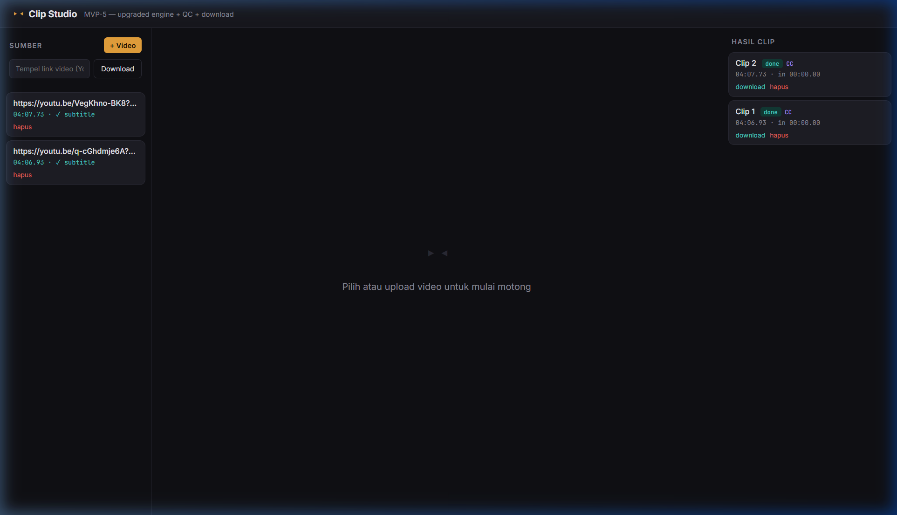
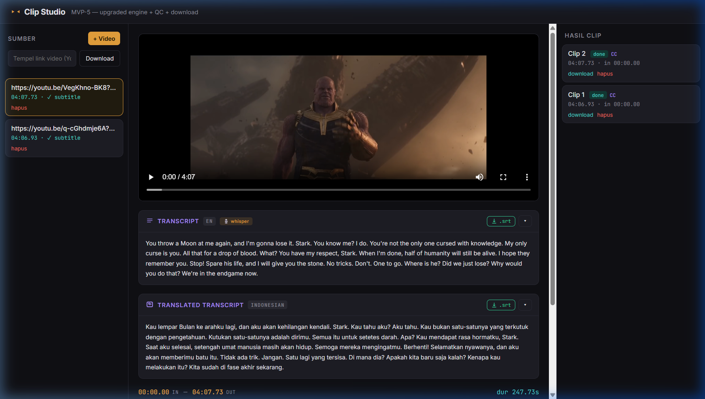

# ▸◂ Clip Studio

> **Local-first video clip editor with AI transcription, subtitle translation, and GPU-accelerated export.**

Clip Studio adalah tool personal berbasis web yang berjalan 100% di lokal — tidak ada cloud, tidak ada biaya tersembunyi. Upload video atau tempel link YouTube, potong bagian yang kamu mau, transcribe dengan Whisper, terjemahkan subtitle dengan AI, lalu export clip dengan subtitle ter-burn langsung di video.

---

## 📸 Screenshots

### Main Interface — Dark, Minimal, Fast


### Editor View — Video + Transcript + Translation


*Transcript EN (Whisper) dan terjemahan Bahasa Indonesia muncul berdampingan langsung di bawah video.*

---

## ✨ Fitur Utama

| Fitur | Detail |
|---|---|
| 📹 **Video Upload** | Upload dari file lokal atau paste link YouTube/URL |
| 🔗 **yt-dlp Integration** | Download video + auto-download subtitle dari YouTube |
| 🎙️ **Whisper Transcription** | Gunakan `faster-whisper` (GPU) atau `openai-whisper` (CPU fallback) |
| 🌐 **AI Translation** | Terjemahkan subtitle ke 15+ bahasa via OpenAI GPT |
| ✂️ **Timeline Trim** | Drag scrubber IN/OUT point untuk memotong video |
| 🔥 **Burn Subtitle** | Burn subtitle (original atau translated) langsung ke video |
| ⚡ **GPU Export** | Gunakan NVIDIA NVENC jika tersedia, fallback ke libx264 (CPU) |
| 📂 **SRT Management** | Upload .srt/.vtt/.ass manual, download transcript & terjemahan |
| 📖 **Glossary Support** | Kamus kata custom untuk meningkatkan akurasi Whisper + LLM |
| 🗃️ **JSON Database** | Semua data disimpan lokal di `storage/db.json` |

---

## 🛠️ Tech Stack

- **Backend** — Node.js + Express 5
- **Frontend** — Vanilla HTML/CSS/JS (no framework)
- **Transcription** — Python: `faster-whisper` (primary) / `openai-whisper` (fallback)
- **Video Processing** — FFmpeg (trim, burn subtitle, export)
- **Video Download** — yt-dlp
- **AI Translation** — OpenAI API (`gpt-4o-mini` / configurable)
- **Storage** — File system + JSON flat-file DB (no database server needed)

---

## ⚙️ Requirements

### Wajib
- **Node.js** v18+
- **FFmpeg** — harus ada di PATH ([ffmpeg.org](https://ffmpeg.org/download.html))
- **Python 3.8+** — untuk transcription

### Python Libraries (pilih salah satu)
```bash
# Opsi A — faster-whisper (REKOMENDASI, butuh GPU/CUDA untuk performa optimal)
pip install faster-whisper

# Opsi B — openai-whisper (CPU-friendly, download model dari Azure CDN)
pip install openai-whisper
```

### Opsional
- **yt-dlp** — untuk download video dari YouTube/URL ([github.com/yt-dlp/yt-dlp](https://github.com/yt-dlp/yt-dlp))
- **NVIDIA GPU + CUDA** — untuk NVENC export dan faster-whisper dengan akselerasi GPU
- **OpenAI API Key** — untuk fitur AI Translation

---

## 🚀 Quick Start

### 1. Clone repo
```bash
git clone https://github.com/Sheva0209/subswift-local-transcribe-and-translation-.git
cd subswift-local-transcribe-and-translation-
```

### 2. Install dependencies
```bash
npm install
```

### 3. Setup environment
Buat file `.env` di root project:
```env
# Wajib jika ingin pakai fitur AI Translation
OPENAI_API_KEY=sk-...

# Opsional — ubah model Whisper (default: large-v3-turbo)
WHISPER_MODEL=large-v3-turbo

# Opsional — paksa pakai CPU/GPU (default: auto-detect)
WHISPER_DEVICE=cuda
```

### 4. Jalankan server
```bash
npm start
```

Buka browser ke **http://localhost:3000** 🎉

---

## 📁 Struktur Project

```
clip-studio/
├── public/
│   ├── index.html          # UI utama (single-page app)
│   ├── app.js              # Frontend logic
│   └── style.css           # Styling dark theme
├── server/
│   └── index.js            # Express server + semua API routes
├── scripts/
│   └── transcribe.py       # Whisper transcription bridge (dual-engine)
├── storage/
│   ├── uploads/            # Video yang diupload
│   ├── clips/              # Hasil export clip
│   ├── transcripts/        # File .srt hasil transcribe & translate
│   └── db.json             # Database flat-file (videos, clips, transcripts)
├── docs/
│   └── screenshots/        # Screenshots untuk README
├── .env                    # API keys & config (tidak di-commit)
├── .gitignore
└── package.json
```

---

## 🔄 Workflow

```
Upload Video / Paste URL
        ↓
  [yt-dlp download]  ← opsional jika dari URL
        ↓
    Video siap di panel "Sumber"
        ↓
  Klik video → Editor terbuka
        ↓
  Transcribe (Whisper) — atau upload .srt manual
        ↓
  Translate subtitle (OpenAI GPT) — opsional
        ↓
  Set IN/OUT point di timeline scrubber
        ↓
  Export Clip (dengan/tanpa burn subtitle)
        ↓
  Download dari panel "Hasil Clip"
```

---

## 🌐 Bahasa yang Didukung (Translation)

English · Indonesian · Japanese · Korean · Spanish · French · German · Mandarin Chinese · Portuguese · Arabic · Hindi · Thai · Vietnamese · Russian · Italian

---

## 🔑 API Endpoints

| Method | Endpoint | Deskripsi |
|--------|----------|-----------|
| `POST` | `/api/videos` | Upload video dari file |
| `POST` | `/api/videos/from-url` | Download video dari URL (yt-dlp) |
| `GET`  | `/api/videos` | List semua video |
| `DELETE` | `/api/videos/:id` | Hapus video + assets terkait |
| `POST` | `/api/videos/:id/transcribe` | Transcribe video dengan Whisper |
| `GET`  | `/api/videos/:id/transcript` | Ambil transcript |
| `PUT`  | `/api/videos/:id/transcript` | Edit transcript |
| `POST` | `/api/videos/:id/transcript/upload` | Upload file .srt manual |
| `GET`  | `/api/videos/:id/transcript/download` | Download .srt transcript |
| `POST` | `/api/videos/:id/translate` | Translate subtitle via AI |
| `GET`  | `/api/videos/:id/translation/download` | Download .srt terjemahan |
| `POST` | `/api/videos/:id/export` | Export clip dengan FFmpeg |
| `GET`  | `/api/clips` | List semua hasil clip |
| `DELETE` | `/api/clips/:id` | Hapus clip |
| `GET`  | `/api/whisper-status` | Cek apakah Whisper tersedia |
| `GET`  | `/api/openai-status` | Cek apakah OpenAI API tersedia |

---

## ⚡ Whisper Model Guide

| Model | VRAM | Kecepatan | Akurasi |
|-------|------|-----------|---------|
| `tiny` | ~1 GB | ⚡⚡⚡⚡ | ★★☆☆☆ |
| `base` | ~1 GB | ⚡⚡⚡ | ★★★☆☆ |
| `small` | ~2 GB | ⚡⚡⚡ | ★★★☆☆ |
| `medium` | ~5 GB | ⚡⚡ | ★★★★☆ |
| `large-v3-turbo` | ~6 GB | ⚡⚡ | ★★★★★ |
| `large-v3` | ~10 GB | ⚡ | ★★★★★ |

Default: `large-v3-turbo` — rekomendasi untuk keseimbangan kecepatan & akurasi.

---

## 📝 Catatan

- File video **tidak** di-push ke GitHub (di-exclude via `.gitignore`)
- Database (`db.json`) bisa di-commit untuk menyimpan metadata project
- Port default: **3000** (bisa diubah via `PORT` di `.env`)
- Server auto-detect NVIDIA NVENC saat startup untuk GPU export
- Script `transcribe.py` mencoba `faster-whisper` dulu, fallback ke `openai-whisper` jika gagal

---

## 📜 License

ISC — bebas dipakai, dimodifikasi, dan didistribusikan.

---

<p align="center">
  Made with ☕ for local-first video workflows
</p>
